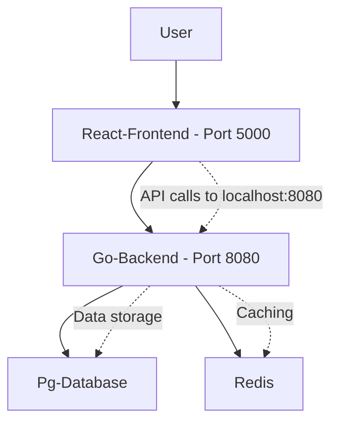
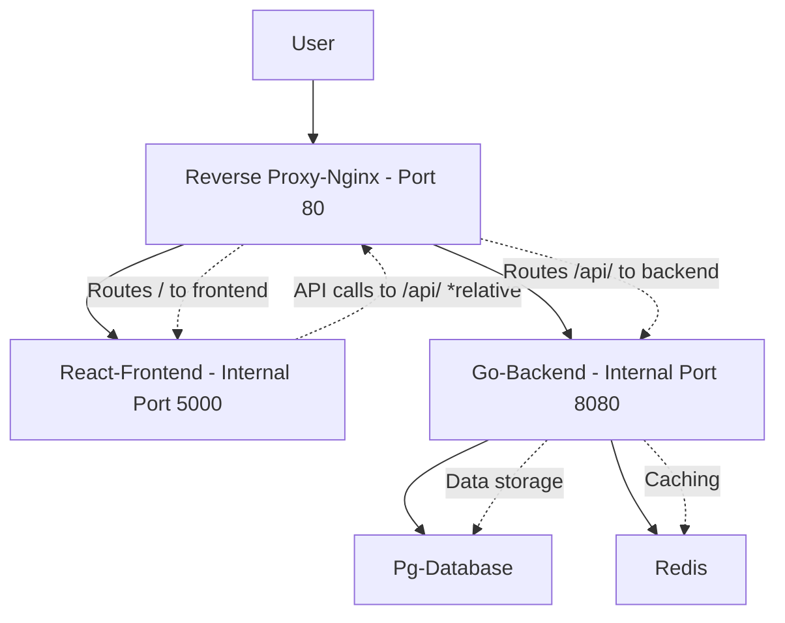

# Docker Networking and Service Communication Guide

This guide explains how the services in this Docker Compose application communicate with each other, how they are specified in the Docker Compose file, and key Docker networking concepts. It's written for beginners, so we'll break it down step by step.

## Overview of the Application

This application consists of several services:
- **Frontend**: A React web application
- **Backend**: A Go API server
- **Database**: PostgreSQL database
- **Redis**: In-memory data store

## How Services Communicate

In Docker Compose, services run in isolated containers but can communicate with each other through a shared network. By default, Docker Compose creates a bridge network for all services in the same `docker-compose.yaml` file.

### Service Discovery
Services can reach each other using their service names as hostnames. For example:
- The backend service can connect to Redis using `redis` as the hostname
- The backend can connect to PostgreSQL using `database` as the hostname

### Communication Flow (Current Setup)



1. **User Access**: Users access the frontend directly through port 5000 on the host.
2. **Frontend-Backend Communication**: The Frontend makes API calls to the Backend using `http://localhost:8080`.
3. **Backend Operations**: The Backend service:
   - Stores and retrieves data from the PostgreSQL database
   - Uses Redis for caching

### What Happens When a Reverse Proxy Server is Included

A reverse proxy server (like Nginx) acts as a single entry point for all client requests. It receives requests from users and forwards them to the appropriate backend services based on routing rules.

#### Benefits of Adding a Reverse Proxy:
- **Single Entry Point**: All traffic goes through one port (e.g., 80 or 443), simplifying firewall rules and SSL configuration.
- **Load Balancing**: Can distribute requests across multiple instances of services.
- **SSL Termination**: Handles HTTPS encryption/decryption, offloading from application servers.
- **Caching**: Can cache static content to improve performance.
- **Security**: Adds an extra layer, can filter requests and hide internal service details.
- **Path-Based Routing**: Routes requests based on URL paths (e.g., `/api/` to backend, `/` to frontend).

#### Updated Communication Flow with Reverse Proxy



1. **User Access**: Users access the application through a single port (e.g., 80) on the reverse proxy.
2. **Routing**: The proxy inspects the URL path:
   - Requests to `/` are forwarded to the Frontend service
   - Requests to `/api/` are forwarded to the Backend service
3. **Frontend Changes**: The frontend can now make API calls using relative paths (e.g., `/api/endpoint`) instead of full URLs, since the proxy handles routing.
4. **Internal Communication**: Backend still communicates with database and Redis using service names, but no longer needs external ports exposed.

#### Configuration Changes
- **Ports**: Only the reverse proxy exposes ports externally; other services keep ports internal.
- **Environment Variables**: Frontend might use relative URLs or proxy-aware configurations.
- **Dependencies**: Proxy service depends on frontend and backend to ensure they start first.

This architecture is common in production deployments and is demonstrated in the `../exe_2.6/` directory of this project, which includes an Nginx reverse proxy configuration.

## How Services Are Specified in docker-compose.yaml

Each service is defined in the `services` section of the `docker-compose.yaml` file:

### Service Definition Structure
```yaml
services:
  service_name:
    image: image_name  # or build: context
    ports:
      - "host_port:container_port"
    environment:
      - KEY=value
    volumes:
      - host_path:container_path
    restart: policy
```

### Environment Variables for Configuration
Services use environment variables to configure connections:
- `REDIS_HOST=redis` tells the backend to connect to the Redis service
- `POSTGRES_HOST=database` tells the backend to connect to PostgreSQL
- `REACT_APP_BACKEND_URL=http://localhost:8080` configures the frontend's API endpoint

### Ports
- **Published Ports**: `ports` mapping exposes container ports to the host
- Allows external access to services

### Dependencies
No explicit `depends_on` in this setup, so services may start in any order.

## Key Docker Networking Concepts

### 1. Bridge Network (Default)
- Docker Compose automatically creates a bridge network
- Containers on the same network can communicate using service names
- Isolated from other networks for security

### 2. Service Names as DNS
- Each service gets a DNS entry matching its name
- No need to know IP addresses - just use the service name

### 3. Port Mapping
- `ports: ["8080:8080"]` maps host port 8080 to container port 8080
- Allows external access to services

### 4. Internal Networking
- Services communicate internally without exposing ports externally
- More secure and efficient

### 5. Volumes for Persistence
- `volumes` mount host directories into containers
- Data persists even if containers are recreated
- Used for database storage in this app

### 6. Restart Policies
- `restart: unless-stopped` ensures services restart automatically
- Improves reliability in production

## Running the Application

To start all services:
```bash
docker compose up -d --build
```

To stop:
```bash
docker compose down
```

The frontend will be available at `http://localhost:5000`, backend at `http://localhost:8080`.

## Troubleshooting

- Check service logs: `docker compose logs service_name`
- Verify network: `docker network ls` and `docker network inspect network_name`
- Test connectivity: `docker compose exec service_name ping other_service`

This setup demonstrates a basic microservices architecture with service communication.